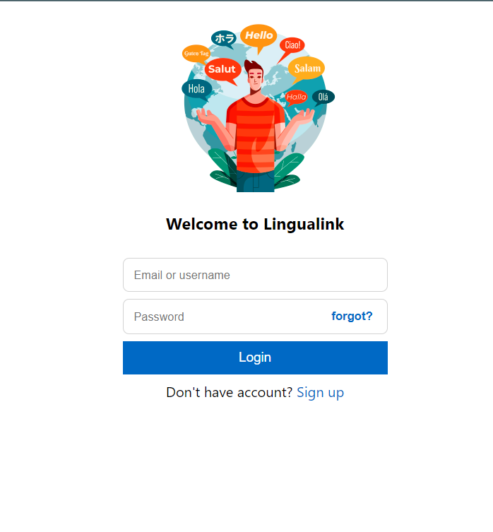
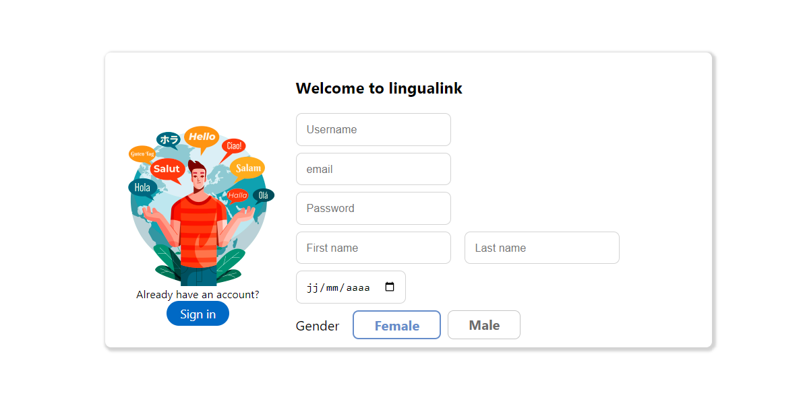
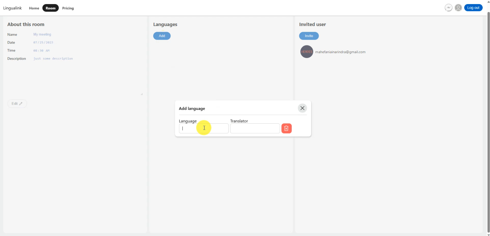
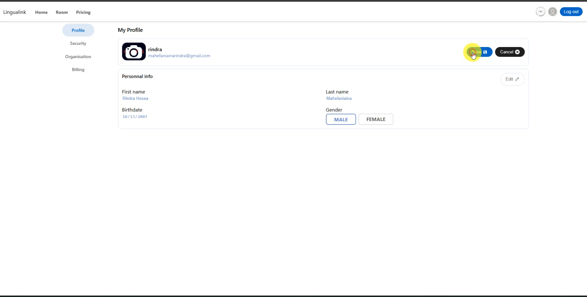

# Lingualink
Lingualink is a platform that allow users or organisations to organize multilanguage meetings. Indeed, other platforms only allow one language into a meeting.
With lingualink, users can attend a metting with his/her prefer language.

## Features
- Email validation
- Reseting password with email
- Payment with Stripe
- Transaltion system
- Creating organization
- Notification to email
- Private or Group chat
- Video chat with WebRTC

## Requirements
- You should have python 3.9 or higher installed
- You should have NodeJs v16 or higher installed
- A MySQL server (XAMPP or WAMPP for example)
- To test it locally, create a google credentials for this project.
- Stripe API key

## Installation
- First, you need to configure google credentials in order to run the project. Create stripe project too.
- Clone the project
```bash
  git clone https://github.com/Hosea2003/lingualink.git
  cd lingualink
```
- Install all the dependecies, for the backend
```bash
  cd lingualink_back
  pip install -r requirements.txt
```
- For the frontend
```bash
  cd lingualink-front
  npm install
```

- Configure the backend. Copy env.example and create .env file. Configure everything like: django-secret-key, database credential, smtp setup, stripe key
- Copy env.example in the frontend too and create .env file.

- Apply migrations in the backend by running
```bash
  python manage.py migrate
```

## Running
To run the backend
```bash
  cd lingualink_backend
  python manage.py runserver
```
To run the frontend
```bash
  cd lingualink-front
  npm start
```

## Preview



